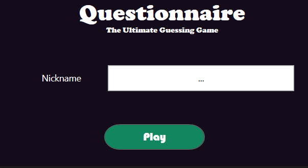

# CSharp - Questionnaire - Assignment

Questionnaire is an app that allows a student to train his/her knowledge about a subject by solving multiple choice questions.

For the moment the application is only console based and is still lacking some functionality. For this assignment you will be extending this functionality and also create a WPF application to serve as a graphical user interface.

**This repository contains the last version of the Questionnaire console application demonstrated by the teacher. Feel free to replace this one with your own app.**

## WPF Main Window

Start by creating a new project inside the `QuestionnaireApp` solution of the type `WPF Application (.NET Core)` and make sure to target `.NET 5` or `.NET 6`.

The `MainWindow` will be the window used for displaying questions and solving them. The idea is that at least the following components are shown to the user:

* The name of the app (pick something nice)
* The question itself
* An image that accompanies the question (use a placeholder for the time being)
* The possible multiple choice answers with a way to select the correct option
* A solve/next button
* A stop button
* The user's score
* A progress bar to show the user's progress (number of questions solved versus number of questions remaining)
* A footer with a note about the author of the app. For example `This app was created by ...`

Feel free to add other things to the GUI or style them as you wish. Just make sure to use colors that agree with each other. Also make sure to use the same style throughout your application.

For the time being you do not need to bind the actual question data to the GUI. Feel free to use some fake question texts.

If you wish you can also experiment with styles in C#. This allows you to apply styles to similar components or target specific components. More info at [How to create a style for a control (WPF .NET)](https://docs.microsoft.com/en-us/dotnet/desktop/wpf/controls/how-to-create-apply-style?view=netdesktop-6.0&viewFallbackFrom=netdesktop-5.0). While it takes some time to learn, it will pay of in the long term.

## Creating a Library

Before we can start using the application logic we first have to transfer the classes from the console application to the WPF application. However, copy pasting them is not a good idea here.

A better solution is to create a library of the classes. Check the course on how to create a library in C#.

This library can then be shared between both the console application and the WPF application.

## Playing

Setup the Questionnaire database when the main window is loaded. Select a random question from the database and populate the UI with the data from the question.

Allow the player to select an answer using the buttons / radio buttons. Try to solve this using a single event handler for all the buttons. Select a new question when the player has chosen his/her answer.

Track how many questions the player has already solved / correctly / incorrectly.

## Questionnaire Game

Notice that your WPF application already contains quitte a lot of game logic.

It

* keeps track of the current question
* keeps track of the number of correct and wrong selected answers
* ...

A lot of this can be abstracted away into a sort of `Game` class.

The `Game` class could have the following public interface:

```
##############################################
# Game
##############################################
##############################################
# + Game(numberOfQuestions: int)
# + CurrentQuestion(): MultipleChoiceQuestion
# + SelectAnswer(index: int): bool
##############################################
```

This is a proposition. Alterations might be required for your specific case.

## A Player Login

Create a nice looking login window for the player where he/she can enter a nickname to play with. An example is shown below.



Your's should of course be designed in the style of your application.

### A Player Class

The next objective is to create a `Player` class that can store the nickname of the user. Create a new class (in the library) that adheres to the following UML model:

```
##############################################
# Player
##############################################
##############################################
# + Player(nickname: string)
# + <<get>> Nickname: string
# - <<get>> Nickname: string
##############################################
```

### Creating a Player

When the user clicks the `Play` button on the login window, a new `Player` object should be instantiated with the text provided in the nickname `TextBox`.

Then open up the main window and pass the player object to the main window via the constructor. Make sure to store the player in a private attribute of the main window class.

Once this is up and running, show the players name in the main window. Feel free on how to implement this.

## Database

The next topic involves setting up a nice MySql database to store the questions and options.

### MySql.Data adapter

Start by installing the `MySql.Data` NuGet package. DO this by right clicking your library project and selecting `Manage NuGet Packages`. Next select the tab `Browse` and search for `MySql`.

Select the `MySql.Data` package and hit the `Install` button.

### A Repository Interface

We have come to a point where we have two sources for our questions, one from a file `questions.txt` and one from a mysql database. This is the perfect opportunity to decouple our class `Game` from the `QuestionDatabase` class (which was actually named badly).

This can be achieved by creating an interface called `IQuestionRepository`. The only method making up the interface is the `GetRandomQuestion()` method:

```csharp
public interface IQuestionRepository
{
    public MultipleChoiceQuestion GetRandomQuestion();
}
```

Now it's time to implement the interface in the `QuestionDatabase` class:

```csharp
public class QuestionDatabase : IQuestionRepository
```

Since it already contains the method `GetRandomQuestion()`, no further action is required.

However, before continuing we should rename our `QuestionDatabase` class to a more suitable name like `QuestionFileRepository`:

```csharp
public class QuestionFileRepository : IQuestionRepository
```

Make sure to change the name of the class, the name of the file and the type inside your `Game` class attribute.

### Decoupling Game from QuestionFileRepository

Implementing the interface is not enough on its own. Our `Game` class is still tightly coupled to the `QuestionFileRepository` class as it still uses this class as a type for an attribute.

We can solve this by changing the internal attribute from:

```csharp
private QuestionFileRepository database = new QuestionFileRepository();
```

to

```csharp
private IQuestionRepository database = new QuestionFileRepository();
```

While the instance is still an object of type `QuestionFileRepository`, the attribute actually references an `IQuestionRepository`.

Make sure to test if your application is still running.

### Creating a QuestionDatabaseRepository

Now we can create a `QuestionDatabaseRepository` class that implements this same interface:

```csharp
public class QuestionDatabaseRepository : IQuestionRepository
{
    public QuestionDatabaseRepository(string database="questionnaire", string username="root", string password="")
    {
        string connectionString = $"server=localhost;userid={username};password={password};database={database}";
        connection = new MySqlConnection(connectionString);
        connection.Open();
        Console.WriteLine($"MySQL version : {connection.ServerVersion}");
    }

    public MultipleChoiceQuestion GetRandomQuestion()
    {
        using var cmd = new MySqlCommand(
            @"SELECT question.text, options.text, options.is_correct
              FROM(SELECT * FROM questions ORDER BY RAND() LIMIT 1) as question
              LEFT JOIN options ON question.id = options.qid
              ; ",
            connection
        );

        using MySqlDataReader reader = cmd.ExecuteReader();

        MultipleChoiceQuestion question = new MultipleChoiceQuestion("");
        while (reader.Read())
        {
            question.Text = reader.GetString(0);
            question.AddOption(new MultipleChoiceOption(reader.GetString(1), reader.GetBoolean(2)));
        }

        return question;
    }

    public void InsertQuestion(MultipleChoiceQuestion question)
    {
        using var cmd = new MySqlCommand(
            "INSERT INTO questions(text) VALUES(@text)",
            connection
        );

        cmd.Parameters.AddWithValue("@text", question.Text);
        cmd.Prepare();
        cmd.ExecuteNonQuery();

        foreach (var option in question.GetOptions())
        {
            InsertOption(option, cmd.LastInsertedId);
        }
    }

    private void InsertOption(MultipleChoiceOption option, long questionId)
    {
        using var cmd = new MySqlCommand(
              "INSERT INTO options(text,is_correct,qid) VALUES(@text,@correct,@qid)",
              connection
        );

        cmd.Parameters.AddWithValue("@text", option.Text);
        cmd.Parameters.AddWithValue("@correct", option.IsCorrect);
        cmd.Parameters.AddWithValue("@qid", questionId);
        cmd.Prepare();
        cmd.ExecuteNonQuery();
    }

    private MySqlConnection connection = null;
```

### The Database

Before we can actually test this we also need to create a database and the appropriate tables. Use the `mysql` client or another tool to setup and provision the database.

```sql
CREATE DATABASE IF NOT EXISTS `questionnaire` DEFAULT CHARACTER SET utf8mb4 COLLATE utf8mb4_general_ci;
USE `questionnaire`;

CREATE TABLE `questions` (
  `id` bigint(20) NOT NULL AUTO_INCREMENT,
  `text` text NOT NULL,
  PRIMARY KEY (`id`)
);

CREATE TABLE `options` (
  `id` bigint(20) NOT NULL AUTO_INCREMENT,
  `text` text NOT NULL,
  `is_correct` tinyint(1) NOT NULL,
  `qid` bigint(20) NOT NULL,
  PRIMARY KEY (`id`),
  FOREIGN KEY (`qid`) REFERENCES `questions`(`id`)
);

INSERT INTO `questions` (`id`, `text`) VALUES (1, 'What has the same name as the class it belongs to in C#?');
INSERT INTO `options` (`id`, `text`, `is_correct`, `qid`) VALUES (NULL, 'A constructor', '1', '1');
INSERT INTO `options` (`id`, `text`, `is_correct`, `qid`) VALUES (NULL, 'A overriding method', '0', '1');
INSERT INTO `options` (`id`, `text`, `is_correct`, `qid`) VALUES (NULL, 'A mutator method', '0', '1');
INSERT INTO `options` (`id`, `text`, `is_correct`, `qid`) VALUES (NULL, 'A property', '0', '1');

INSERT INTO `questions` (`id`, `text`) VALUES (2, 'Interfaces allow us to ...');
INSERT INTO `options` (`id`, `text`, `is_correct`, `qid`) VALUES (NULL, 'decouple classes from each other', '1', '2');
INSERT INTO `options` (`id`, `text`, `is_correct`, `qid`) VALUES (NULL, 'create smaller implementations', '0', '2');
INSERT INTO `options` (`id`, `text`, `is_correct`, `qid`) VALUES (NULL, 'cleanup our public methods', '0', '2');
INSERT INTO `options` (`id`, `text`, `is_correct`, `qid`) VALUES (NULL, 'use composition', '0', '2');

INSERT INTO `questions` (`id`, `text`) VALUES (3, 'What keyword/symbol is used when a class implements an interface?');
INSERT INTO `options` (`id`, `text`, `is_correct`, `qid`) VALUES (NULL, ':', '1', '3');
INSERT INTO `options` (`id`, `text`, `is_correct`, `qid`) VALUES (NULL, '=>', '0', '3');
INSERT INTO `options` (`id`, `text`, `is_correct`, `qid`) VALUES (NULL, 'implements', '0', '3');
INSERT INTO `options` (`id`, `text`, `is_correct`, `qid`) VALUES (NULL, 'inherits', '0', '3');
```

### Using the QuestionDatabaseRepository

Now instead of fetching our questions from a file, we want to use the database. This can very easily achieved by instantiating a `QuestionDatabaseRepository` in the `Game` class instead of `QuestionFileRepository`:

```csharp
private IQuestionRepository database = new QuestionDatabaseRepository();
```

## Extra Grader

You can earn extra grades by implementing one/some of the following features:

* A scoreboard of the players
* Allowing the user to add questions
* Allow the user to choose some test options (for example number of questions)
* Storing the scores of the players in the database
* ...
